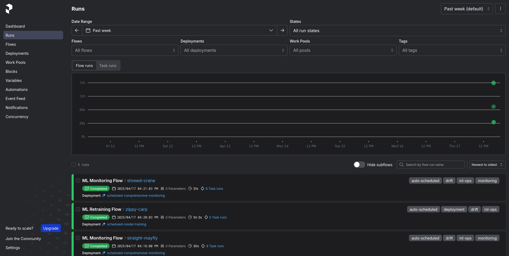
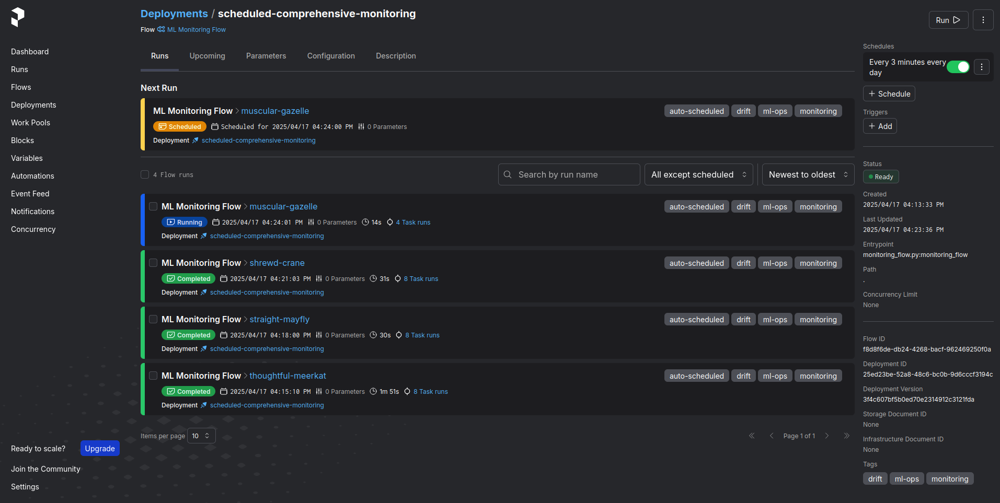
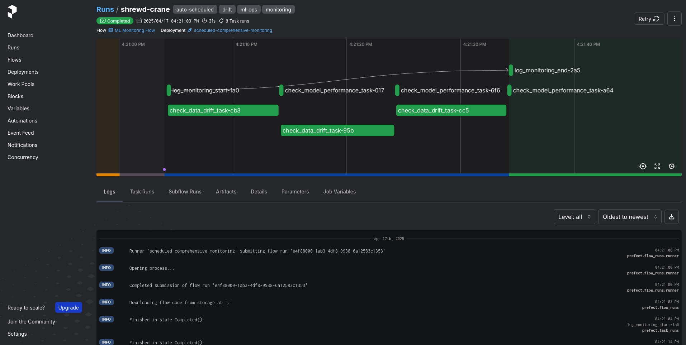

# Customer Retention System

A comprehensive machine learning system that handles the entire ML lifecycle from data ingestion to model deployment, focused on predicting and improving customer retention.

[](https://github.com/yourusername/customer-retention-system/actions)

## Project Overview

This project implements a complete machine learning pipeline for customer retention prediction with:

- Automated data ingestion and processing
- Model training and evaluation
- Model deployment as microservices
- Model monitoring and performance tracking
- User-friendly interfaces for interacting with the system

The system is designed with a microservices architecture using Docker containers, ensuring scalability and ease of deployment.

## Architecture

```
customer-retention-system/
├── notebooks/              # Experimental Jupyter notebooks
├── src/
│   ├── data_ingestion/     # Data ingestion and processing services
│   ├── training/           # Model training pipeline
│   ├── deployment/         # Model deployment services
│   ├── monitoring/         # Monitoring services (Prometheus, Grafana)
│   └── prefect/            # Workflow orchestration
├── config/                 # Configuration management
├── tests/                  # Automated tests
├── docker-compose.yml      # Container orchestration
├── .github/workflows/      # CI/CD pipeline configuration
└── requirements.txt        # Dependencies
```

## Key Features

- **End-to-End ML Pipeline**: Handles all aspects of the machine learning lifecycle
- **Microservices Architecture**: Components are containerized for scalability and isolation
- **Model Versioning & Tracking**: Integrated with MLflow for experiment tracking
- **Automated Monitoring**: Prometheus and Grafana dashboards for system monitoring
- **CI/CD Integration**: Automated testing and deployment via GitHub Actions
- **Multiple Interfaces**: Flask API endpoints and Streamlit UI for interacting with the system
- **Extensible Model Framework**: Easily add or swap models as needed

## Models Implemented

The system includes several regression models for customer retention prediction:
- Linear Regression
- Decision Tree Regression
- Random Forest Regression
- XGBoost Regression

The modular design makes it easy to add new models to the pipeline based on your specific needs.

## Adaptability

While built for customer retention prediction, this framework can be readily adapted for other machine learning use cases by:
- Updating data ingestion components for new data sources
- Modifying preprocessing steps for different data types
- Adding new machine learning models appropriate for the specific problem
- Adjusting evaluation metrics based on the new objectives
- Customizing the UI/API endpoints for the new application

The microservices architecture ensures that individual components can be modified without disrupting the entire system.

## Workflow Orchestration with Prefect

The project uses Prefect for orchestrating the ML pipeline workflows. Below are visualizations of the flows:

### Scheduled Runs


### Flow Runs


### Flow Diagram



## Technologies Used

- **Machine Learning**: scikit-learn, XGBoost
- **Workflow Orchestration**: Prefect
- **Model Tracking**: MLflow
- **Containerization**: Docker
- **Monitoring**: Prometheus, Grafana
- **Database**: SQLite
- **Web Interfaces**: Flask, Streamlit
- **CI/CD**: GitHub Actions

## Getting Started

### Prerequisites
- Docker and Docker Compose
- Python 3.8+

### Installation
1. Clone the repository
   ```
   git clone https://github.com/yourusername/customer-retention-system.git
   cd customer-retention-system
   ```

2. Run the system using Docker Compose
   ```
   docker-compose up
   ```

3. Access the Streamlit UI at http://localhost:8501

4. API endpoints are available at http://localhost:5000

## Usage

### API Endpoints
- `/predict` - Get retention predictions for new customers
- `/process` - Process new data
- `/train` - Training models

### Streamlit UI
The Streamlit interface provides an interactive way to:
- Upload customer data
- Process and save data to database
- Train model
- Deploy model

## Development

### Adding New Models
1. Create a new model class in `src/training/train/`
2. Register the model in the model registry
3. Update configuration as needed

### Running Tests
```
pytest tests/
```
